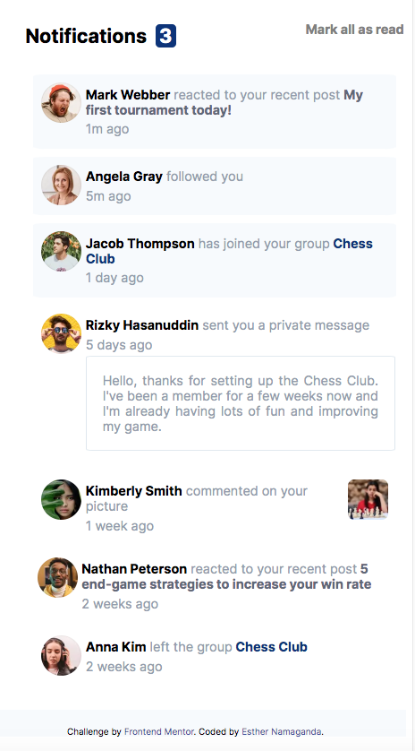
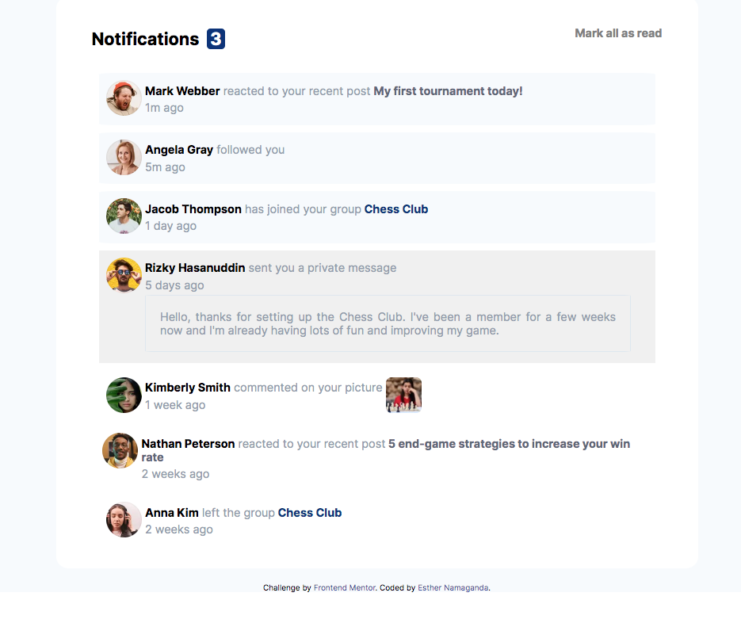

# Frontend Mentor - Notifications page solution

This is a solution to the [Notifications page challenge on Frontend Mentor](https://www.frontendmentor.io/challenges/notifications-page-DqK5QAmKbC). Frontend Mentor challenges help you improve your coding skills by building realistic projects. 

## Table of contents

- [Overview](#overview)
  - [The challenge](#the-challenge)
  - [Screenshot](#screenshot)
  - [Links](#links)
- [My process](#my-process)
  - [Built with](#built-with)
  - [What I learned](#what-i-learned)
  - [Continued development](#continued-development)
  - [Useful resources](#useful-resources)
- [Author](#author)
- [Acknowledgments](#acknowledgments)


## Overview

### The challenge

Users should be able to:

- Distinguish between "unread" and "read" notifications
- Select "Mark all as read" to toggle the visual state of the unread notifications and set the number of unread messages to zero
- View the optimal layout for the interface depending on their device's screen size
- See hover and focus states for all interactive elements on the page

### Screenshot






### Links

- Solution URL: [Github-namaganda-esther](https://github.com/namaganda-esther/Frontend-mentor-challenges-folder/tree/main/notifications-page-main)
- Live Site URL: [Github Pages](https://namaganda-esther.github.io/Frontend-mentor-challenges-folder/)

## My process

### Built with

- Semantic HTML5 markup
- CSS custom properties
- Flexbox
- CSS Grid
- Mobile-first workflow


### What I learned


To see how you can add code snippets, see below:

```html
 <p><span class="name">Jacob Thompson</span><span class="mid-text"> has joined your group</span><span class="chess"> Chess Club</span><span class="dot"></span></p>
 amazed at how the span element works
```

```css
.container{
    background-color: hsl(210, 60%, 98%);
    font-size: 16px;
    font-family: 'Inter', sans-serif;
    width: 100%;
}

.content{
    margin: auto;
    background-color: hsl(0, 0%, 100%);
    padding-left: 50px;
    padding-right: 50px;
    padding-top: 20px;
    padding-bottom: 20px ;
    border-radius: 2%;
    width: 90%;
    max-width: 800px;
}
```

```js
  notifications.forEach(notification => {
      notification.classList.toggle('unread');
      notification.classList.toggle('read');
  }
```


### Continued development

I want to continue exploring javascript functions. marking read and unread notifications and ensure that they work once someone clicks that its unread or read.


### Useful resources

- [Geeks for Geeks](https://www.geeksforgeeks.org/) - This helped me with some css and javacript.
- [w3schools](https://www.w3schools.com/) - This helped me with some css and javacript.


## Author

- Website - [Esther Namaganda](https://www.your-site.com)
- Frontend Mentor - [@namaganda-esther](https://www.frontendmentor.io/profile/namaganda-esther)
- Twitter - [@prudence_esther](https://www.twitter.com/prudence_esther)


## Acknowledgments
I want to thank myself for believing that i can do this. for the first time i didnt have to rely so much on the internet for everything.

